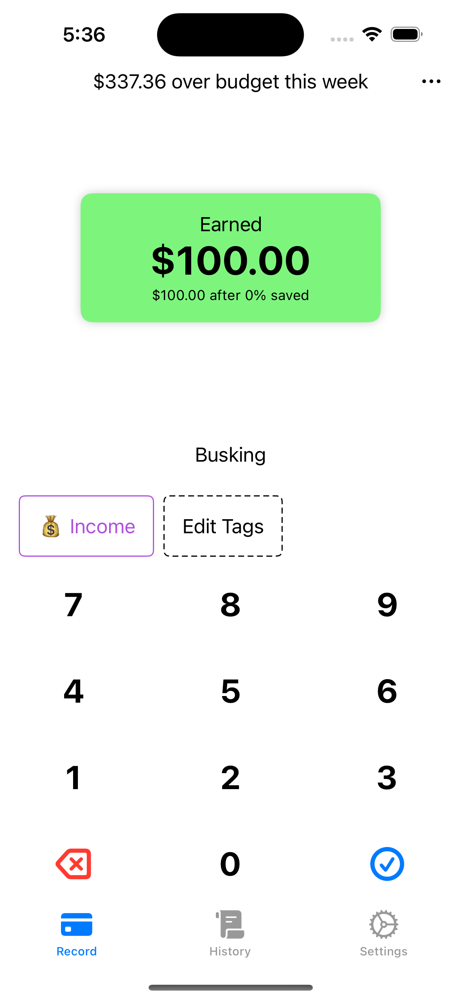
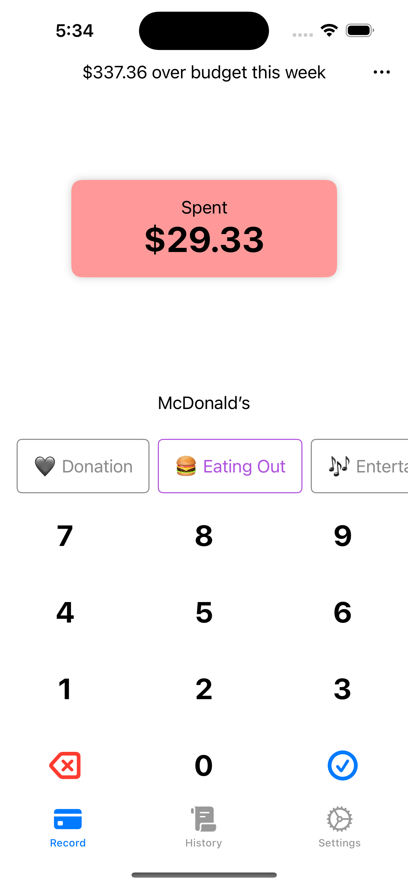
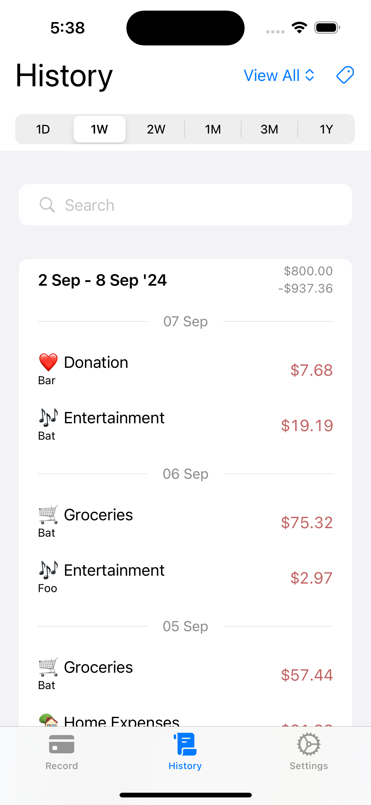
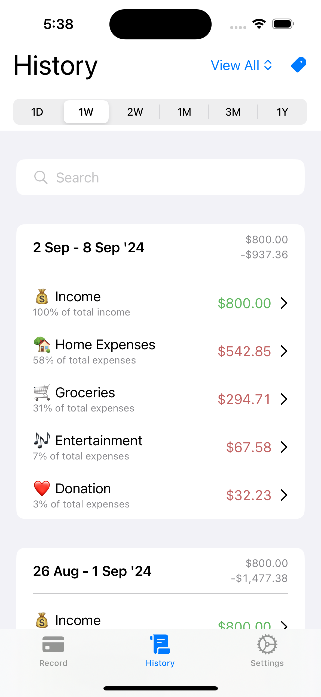
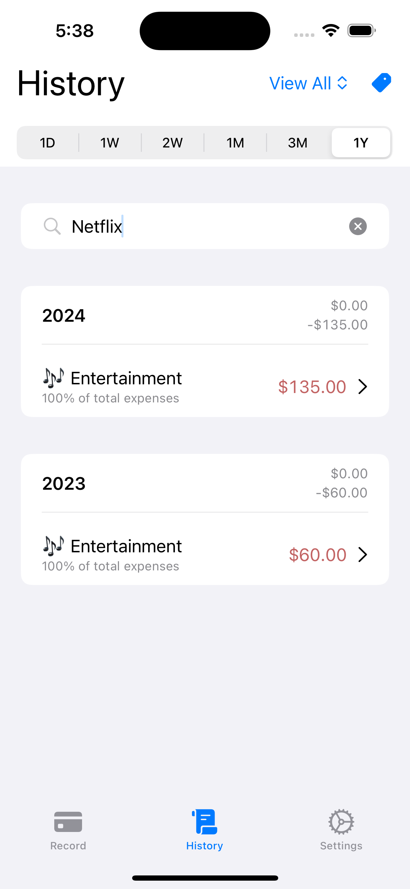
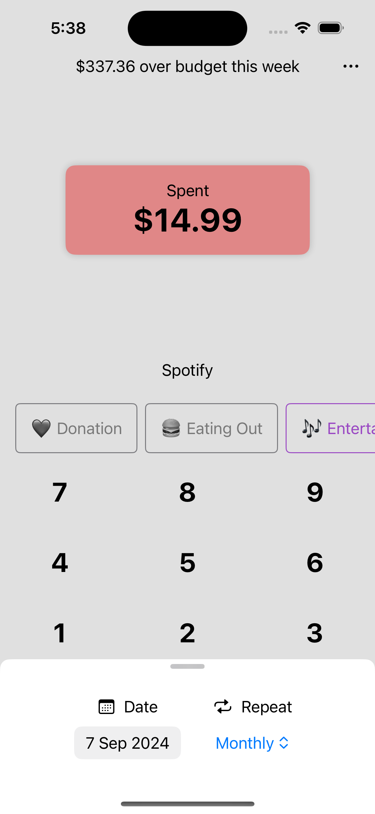
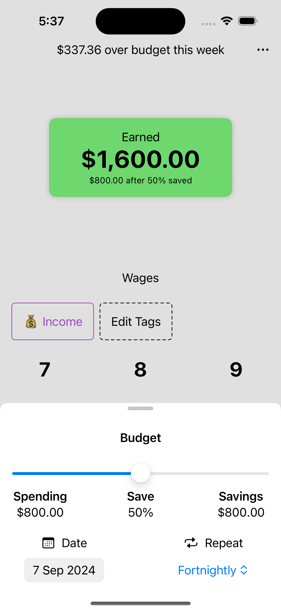
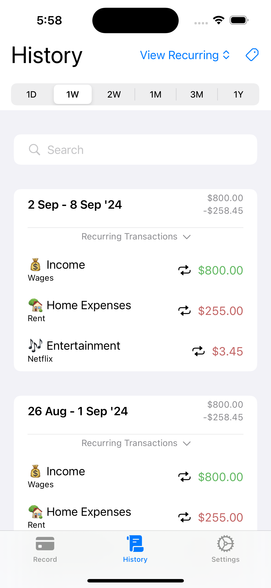

#  Budgeteur
Budgeteur is an iOS app for keeping track of your income and expenses, in other words your budget.

This app was developed as an exercise to learn Swift and SwiftUI.
It is a clone of the iOS app [Nudget](https://nudgetapp.com) with the most of the functionality and some minor changes in the UI design.

This app is intended for study purposes only, and is not published on the app store.

## Features
### Record your income and expenses.
 

### View a record of your income and expenses, and summarise by category.
 

### Search your expenses.
 

### Keep track of recurring income and expenses.
  

## Try the App
The easiest way to try out the app is to run it in a simulator via Xcode.
Just clone this git repo onto a computer running macOS, open the repo folder with Xcode and press the run button.
Note that this app was developed for older versions of iOS and SwiftUI, so it may contain unknown bugs.
